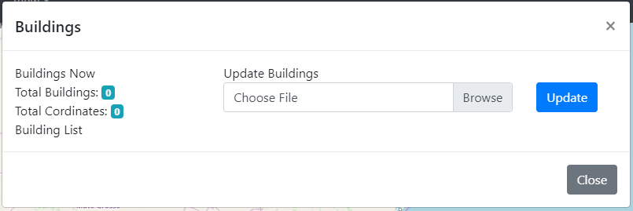
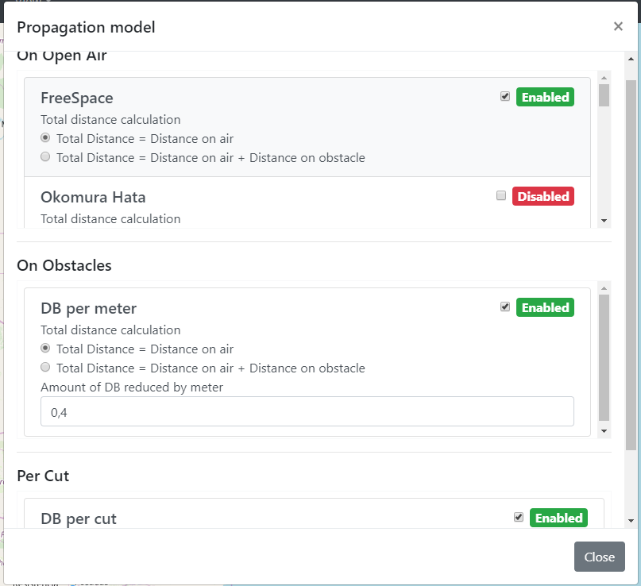

# RP-Sim: Radio Propagation Simulator

RP-Sim is a completly free environment for simulate the propagation of wireless communication. Our goal with this project is allow students, teachers, researchers and companies better undestand radio propagation models e better plan the deployment of antennas.

  

## Functionalities

* Calculate received RSSI
* Calculate Bit Error Rate
* Export areas that can communicate with any antenna
* Many propagation models to be used

## Propagation Models

There are already many propagation models ready to be used 

- For no obstacles
    - :white_check_mark: SUI
    - :white_check_mark: Egli
    - :white_check_mark: Ericsson
    - :white_check_mark: Nakagami-m
    - :white_check_mark: Free Space
    - :white_check_mark: Okomura Hata
    - :white_check_mark: Two Ray Ground
    - :white_check_mark: Fixed Distance
- For obstacles
    - :white_check_mark: By distance on obstacles
- Cut on Signal
    - :white_check_mark: For cuts caused by obstacles

We plan to add some more but you can feel free to add your own!

### How to create new propagation model

It is really easy to add new propagation models to RP-Sim.

The file `assets/tool/ModelsPropagation.js` contains all propagation models

Here is a template used to implement the FreeSpace model. You can copy the code below, edit the class name, the calculate method and adjuste the popualteHTML method.

The `populateHTML()` is called on the constructor and it's function is insert the controls for this method in the right location for the user to be able to use it.

The `calculate()` method is called if this propagation model is enabled. It will always receive 3 parameters: distance on air, distance on obstacle and number of cuts caused by obstacles.

Inside this method you can decide how to use this parameters to calculate the RSSI.

There are 3 classes you can extend: PropagationOnAir, PropagationObstacle and PropagationCut. They are choosen based on what information the propagation model use.

    class PropagationOnAir_FreeSpace extends PropagationOnAir {
        constructor(supressHtml=false){
            super()

            this.tipo = "freespace"
            this.tipoCalculoDistancia = 1
            if(!supressHtml){
                this.populateHTML()
            }
        }

        populateHTML(){
        }

        calculate(dist_out, dist_ins, amt_walls){
            let dist = null;
            if(this.tipoCalculoDistancia==1){
                dist = (dist_out)/1000 // kilometers
            }else if(this.tipoCalculoDistancia==2){
                dist = (dist_out+dist_ins)/1000 // kilometers
            }

            let F = -(20*Math.log10(dist)+20*Math.log10(SD.getFrequencyMhz())+32.44-SD.gtx-SD.grx)
            return F
        }
    }

## Available Modulations

The available modulation on the simulator are:

- :white_check_mark: BSPK, QPSK
- :white_check_mark: 8PSK
- :white_check_mark: 16PSK
- :white_check_mark: 4QAM
- :white_check_mark: 16QAM
- :white_check_mark: 64QAM

If you need to add a new one you can just edit the function `snr_ber` on `assets/tool/ModelsPropagation.js`. The only parameter received on this function is the RSSI.

## Configuration

There are a lot of configuration that can be usefull while using RP-sim!

Some more general configuration

  

Configuration related to the communication

  

Configuration related to the antennas

  

Configurations related to the buildings

  

Configuration and control of the propagation models

  

