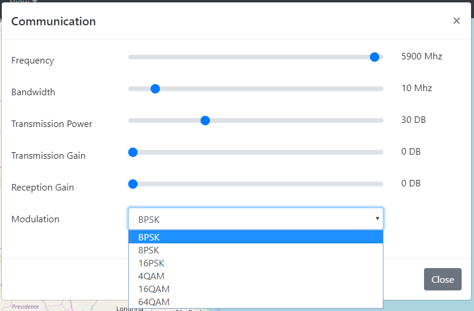

# RP-Sim: Radio Propagation Simulator

RP-Sim is a completely free environment to simulate the propagation of wireless communication. Our goal with this project is to allow students, teachers, researchers, and companies to improve comprehension of radio propagation models and select the best positions for antennas.

  

Access the demo here! [Live demo](https://matheusferraroni.github.io/RP-Sim/)

## Requirements

Browser :earth_americas:

## Functionalities

* Calculate received RSSI
* Calculate Bit Error Rate
* Export areas that can communicate with any antenna
* Many propagation models to be used

## Propagation Models

There are already many propagation models ready to be used 

- For air
    - :white_check_mark: SUI
    - :white_check_mark: Egli
    - :white_check_mark: Ericsson
    - :white_check_mark: Nakagami-m
    - :white_check_mark: Free Space
    - :white_check_mark: Okomura Hata
    - :white_check_mark: Two Ray Ground
    - :white_check_mark: Fixed Distance
- For obstacles
    - :white_check_mark: By distance on obstacles
- Cut on Signal
    - :white_check_mark: For cuts caused by obstacles

We plan to add some more, but you can feel free to add your own and contribute to this project!

### How to create new propagation model

It is effortless to add new propagation models to RP-Sim.

The file `assets/tool/ModelsPropagation.js` contains all propagation models

Here is a template used to implement the FreeSpace model. You can copy the code below, edit the class name, the calculate method and adjust the popualteHTML() method.

The `populateHTML()` is called on the constructor and its function is to insert the controls for this method in the right location for the user to be able to use it.

The `calculate()` method is called if this propagation model is enabled. It will always receive three parameters: distance on-air, distance inside obstacles, and the number of cuts caused by obstacles.

Inside this method, you can decide how to use these parameters to calculate the RSSI.

There are three classes you can extend: PropagationOnAir, PropagationObstacle, and PropagationCut. They are chosen based on what information the propagation model use.

    class PropagationOnAir_FreeSpace extends PropagationOnAir {
        constructor(supressHtml=false){
            super()

            this.tipo = "freespace"
            this.tipoCalculoDistancia = 1
            if(!supressHtml){
                this.populateHTML()
            }
        }

        populateHTML(){
        }

        calculate(dist_out, dist_ins, amt_walls){
            let dist = null;
            if(this.tipoCalculoDistancia==1){
                dist = (dist_out)/1000 // kilometers
            }else if(this.tipoCalculoDistancia==2){
                dist = (dist_out+dist_ins)/1000 // kilometers
            }

            let F = -(20*Math.log10(dist)+20*Math.log10(SD.getFrequencyMhz())+32.44-SD.gtx-SD.grx)
            return F
        }
    }

## Available Modulations

The available modulation on the simulator are:

- :white_check_mark: BSPK, QPSK
- :white_check_mark: 8PSK
- :white_check_mark: 16PSK
- :white_check_mark: 4QAM
- :white_check_mark: 16QAM
- :white_check_mark: 64QAM

If you need to add a new modulation, it is possible to edit the function `snr_ber` on `assets/tool/ModelsPropagation.js`. The only parameter received on this function is the RSSI.

## Configuration

There are a lot of configurations that can be useful while using RP-sim!

Some more general configuration

  

Configuration related to the communication

  

Configuration related to the antennas

  

Configurations related to the buildings

  

Configuration and control of the propagation models

  

## How to use it

Video with a presentation about RP-Sim and a demonstration (PT).

Video with a quick view of how to use it (no sound)

### Step by step of how to use it

1. Clone the repository or download the zip
2. Extract somewhere (Normally this work better if you are using a web development environment and extract in their folder to access from the browser (They need to be running.))
3. Access RP-Sim by typing the folder on the browser (Or localhost/RP-Sim if you are using a web development environment)
(The version on Github is shipped with two datasets you can use to test the tool!)
4. Click on config buildings on the right menu
5. Click on "Browse" and select the file `data/sp_buildings.geojson` and click on "Update".
6. Click on config antenna on the right menu
7. Click on "Browse" and select the file `data/sp_antenna.geojson` and click on "Update".
8. You can play with the configurations of "Environment" and "Communication", but we suggest that you leave this as it is for the first run. So you can know the tool once you change it
9. Click on calculate. Wait for a few seconds as the process is being done. This changes according to the zoom that you are using. More zoom means more granularity and slower processing
10. Now you have a beautiful and colorful map! Don't change the zoom and change the transmission power on the settings of communication
11. Click on calculate again. If you didn't change the zoom the processing now is faster! The heavy processing is cached for each zoom 
12. Click on "View" and "BER". Now the map change the colors and you can see the bit error rate estimated for each location
13. You can click on "Environment" and change the value of "Noise Figure" and click on "Communication" and change the "Modulation". This will let you see easier this metric
14. Click on "Export" and "Communication Area"
15. Change the values for each area and click on export
16. You've done almost everything cool! You can explore the rest now

## How to cite

[Original Publication](https://sol.sbc.org.br/index.php/sbrc_estendido/article/view/12395)

-   BibTeX
> @inproceedings{sbrc_estendido,
 author = {Matheus Sanches and Oscar Jaime  Coral and Leandro  Villas},
 title = {RP-Sim: Radio Propagation Simulator},
 booktitle = {Anais Estendidos do XXXVIII Simpósio Brasileiro de Redes de Computadores e Sistemas Distribuídos},
 location = {Rio de Janeiro},
 year = {2020},
 keywords = {},
 issn = {2177-9384},
 pages = {1--8},
 publisher = {SBC},
 address = {Porto Alegre, RS, Brasil},
 doi = {10.5753/sbrc_estendido.2020.12395},
 url = {https://sol.sbc.org.br/index.php/sbrc_estendido/article/view/12395}
}

- ABNT

> SANCHES, Matheus Ferraroni; CORAL, Oscar Jaime Ciceri ; VILLAS, Leandro Aparecido . RP-Sim: Radio Propagation Simulator. _In_: SALÃO DE FERRAMENTAS - SIMPÓSIO BRASILEIRO DE REDES DE COMPUTADORES E SISTEMAS DISTRIBUÍDOS (SBRC), 38. , 2020, Rio de Janeiro. **Anais** [...]. Porto Alegre: Sociedade Brasileira de Computação, 2020 . p. 1-8. ISSN 2177-9384. DOI: [https://doi.org/10.5753/sbrc_estendido.2020.12395](https://doi.org/10.5753/sbrc_estendido.2020.12395).